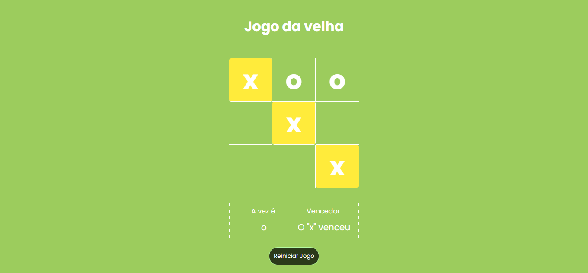

# Jogo da Velha

Este é um simples Jogo da Velha desenvolvido com JavaScript, HTML e CSS. O jogo permite que dois jogadores se alternem entre "X" e "O" e destaca a combinação vencedora.

## Funcionalidades

-   **Indicação da Vez**: Mostra de quem é a vez (X ou O) durante o jogo.
-   **Detecção de Vitória**: O jogo automaticamente detecta e destaca a combinação vencedora.
-   **Empate**: Indica quando o jogo termina em empate, sem vencedor.
-   **Reiniciar Jogo**: Um botão de reinício está disponível para começar uma nova partida a qualquer momento.

## Tecnologias Utilizadas

-   **HTML**: Estrutura do jogo.
-   **CSS**: Estilização do layout, incluindo destaque das células vencedoras.
-   **JavaScript**: Lógica do jogo, controle de turnos, verificação de vitória e reinicialização.

## Como Usar

1.  Clone este repositório em sua máquina local:
    
    bash
    
    Copiar código
    
    `git clone https://github.com/seu-usuario/seu-repositorio.git` 
    
2.  Navegue até o diretório do projeto:
    
    bash
    
    Copiar código
    
    `cd nome-do-diretorio` 
    
3.  Abra o arquivo `index.html` em seu navegador para começar a jogar.
    

## Captura de Tela

Aqui está uma prévia do jogo:

## Contribuição

Contribuições são bem-vindas! Sinta-se à vontade para abrir issues e enviar pull requests.

## Licença

Este projeto está licenciado sob a licença MIT. Veja o arquivo LICENSE para mais detalhes.
